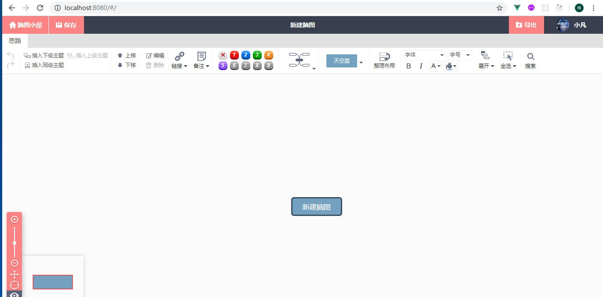
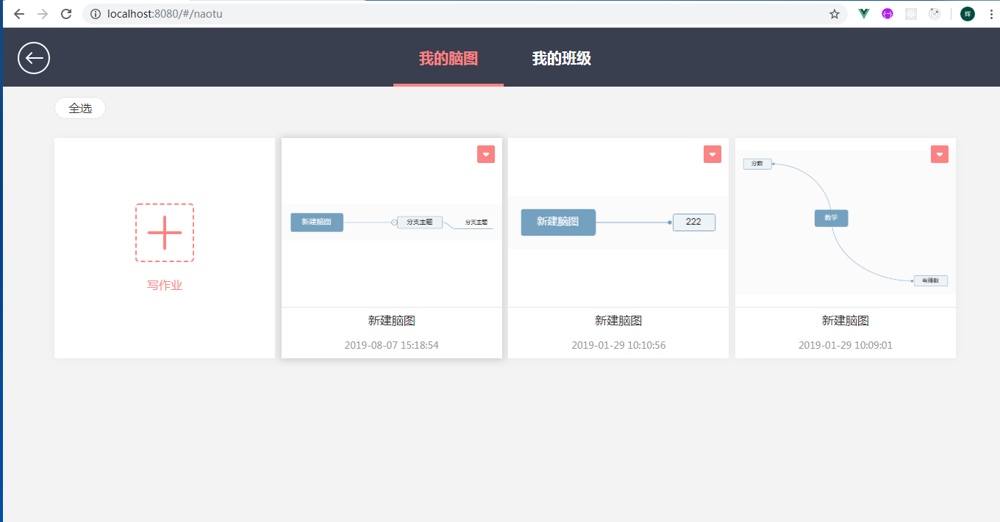
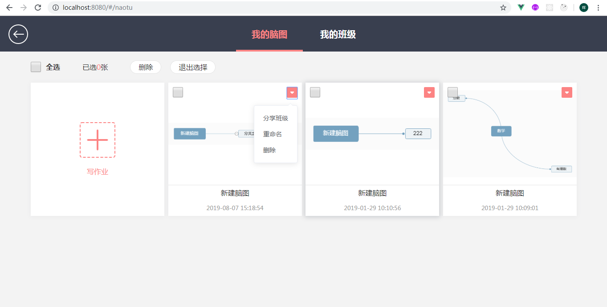
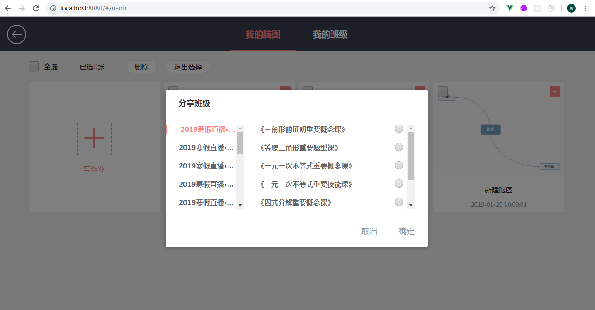
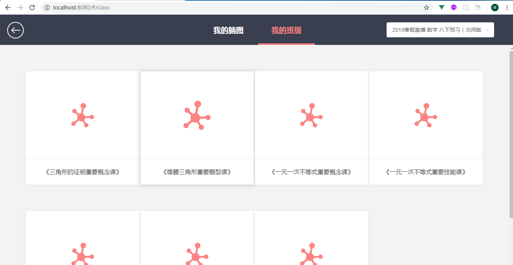
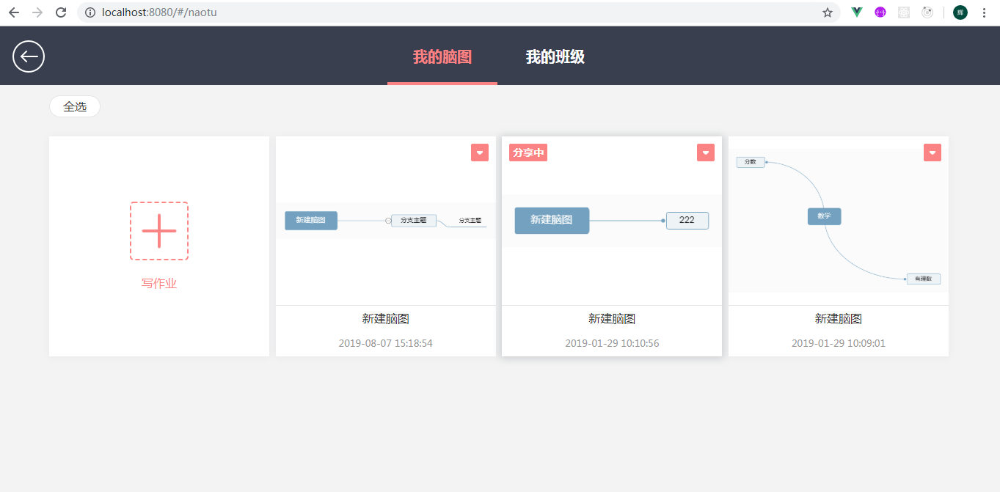
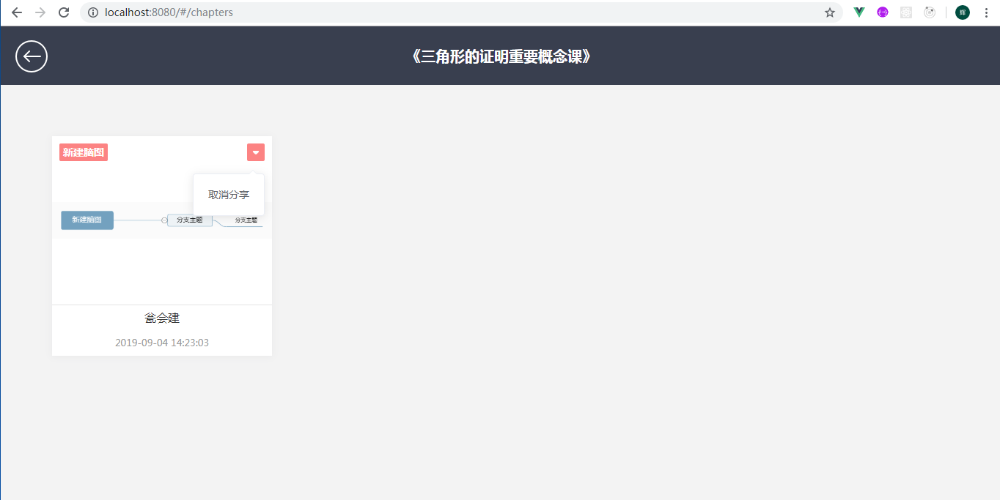
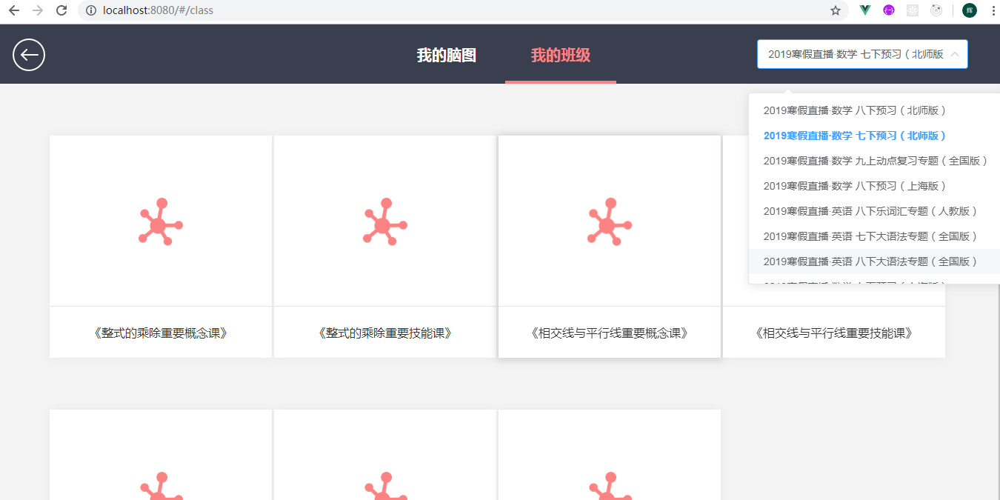
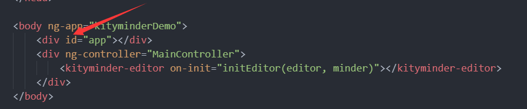
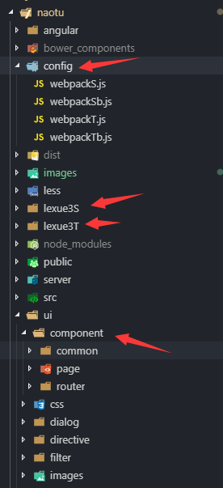

## 在百度脑图上二次开发，在百度脑图添加了一些新的功能
## 百度脑图基于 kityminder-core 搭建，依赖于 AngularJS 1.3，包含 UI 和热盒 [hotbox]底层还有kity都是基于svg的。及其复杂 [百度脑图地址](http://naotu.baidu.com)。

## **开发初衷 **
- 由于公司是做教育的，可能给孩子布置脑图作业。由于现在的百度脑图功能还不能和公司的需求想结合，现在的百度脑图是需要注册的也考虑到学习的孩子还比较小还可能不会注册。

## **预览**

## **技术站**
- **vue、vue-router、axios、element-ui**

## **实现功能**

### **首页**
- 在首页头部实现了 **脑图小屋、保存、导出等功能**
- 在百度脑图的入口文件,添加了一个vue挂载id=app 。
- 所有自己写vue文件都放在ui/component文件夹下面
- webpack打包配置放在config文件夹下面
- 保存功能 主要在百度脑图上面有一个全局的对象 **minder下面有个获取脑图对象数据的方法为exportJson()** 把获取的数据通过接口传给后端就保存之前画完的脑图了。
- 导出功能 主要用到 **minder.exportData()方法是需要传到处的格式的返回的是一个Promise对象所以需要这么写minder.exportData('png').then(data => {console.log(data)})data就是图片导出的数据了** 。
- 点击 **脑图小屋** 就跳转到脑图小屋页面

### **脑图小屋页**
- 其实只要用vue合并到脑图上了其实就简单了，因为剩下的都是实现vue的代码逻辑了。
- 脑图小屋实现的功能 **我的脑图和我的班级切换、全选、删除、退出选择、可以写作业、分享脑图到班级里面、重命名、删除等功能**
- 点击作业脑图能打开脑图，这里主要用到的方法 **minder.importJson()把之前通过接口保存的脑图再取出来放到minder.importJson(data)里面就能展开脑图了**。

### **我的班级页**
- 就是这个学生报的班级都现在在**我的班级页面** 分享的脑图指定班级就到我的班级页面里面了。
- 点开**我的班级**就能看到我画的脑图了。这个脑图可以点击取消分享就到我的脑图小屋了。
- 我的班级页有下拉列表现在科目和版本。

## 主要目录结构 
- **这是build出来的文件夹lexue3S是学生端lexue3T是教师端**

## **安装**
- 首先执行 npm  install

- 跑学生版脑图,执行 npm run vueDevS;

- 打包学生版脑图,执行 npm run vueBuildS

- 跑教师版脑图,执行 npm run vueDevT

- 打包教师版脑图,执行 npm run vueBuildT

## 要是修改了脑图部分记得先执行 npm run build 一下。 

## 由于学生端做完作业需要提交到教师那里所有做了一个学生端的和一个教师端的功能都差不多，上面只粗劣的介绍了一下学生端，教师端的脑图其实也差不多。

